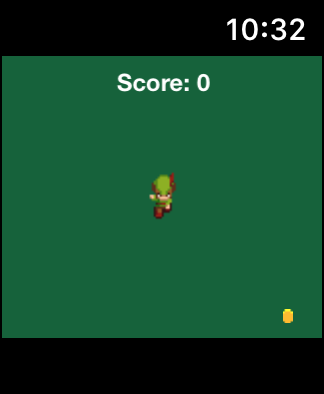
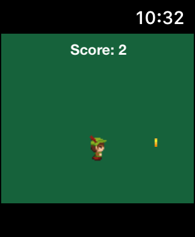
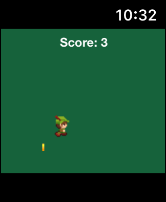

# Haptic and Gestures Anatomy 101

Se você quer ser um Mestres desas tecnologias e ainda conseguir implementar um joguinho para Apple Wacth, veio ao lugar certo!

Este repo contém um código template que contém o exemplo de um tutorial para implementação de um jogo simples para WatchOS utilizando o framework SpriteKit com a linguagem Swift e ainda por cima aprendendo a utilizar **Swipe Gestures** e **Resposta Háptica** no Rélogio Intelifente da Maça.

Se você leu até aqui já é um lindão e tem meu respeito!

## Screenshots

